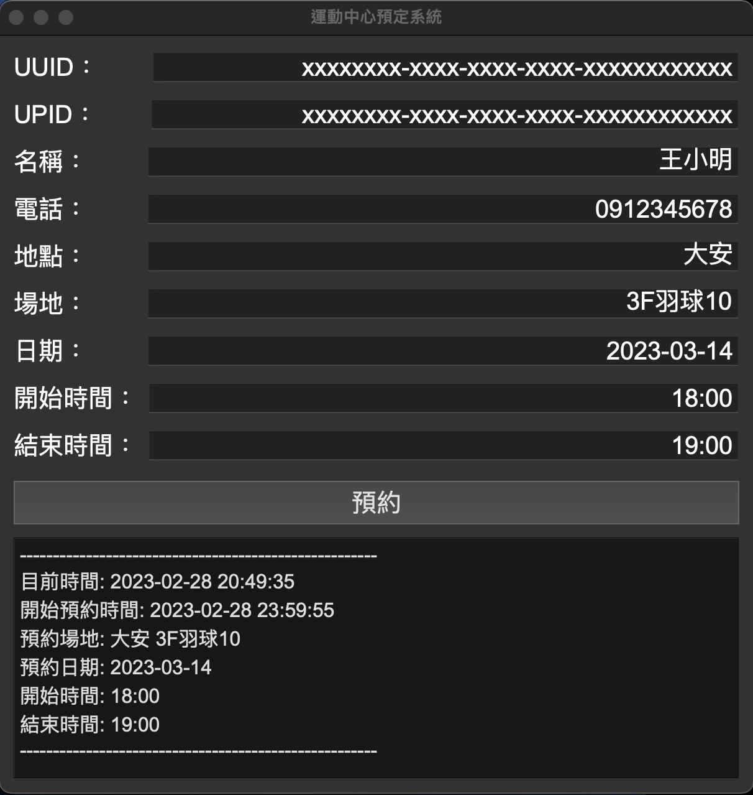

# sport-venue-reserve-bot

## Installation
```
pip install -r requirements.txt
```

## Usage
```
python main.py
```

## Parameter
* UUID：手機 App -> 個人 -> 設定(右上角齒輪) -> UUID
* UPID：User Personal ID (需要用抓包工具才能取得)
* 名稱：手機 App -> 個人-> 查看個人檔案 -> 姓名
* 電話：手機 App -> 個人-> 查看個人檔案 -> 手機
* 場地：預約的場地名稱
* 日期：預約的場地日期
* 開始時間：預約的場地開始時間
* 結束時間：預約的場地結束時間

## Demo

